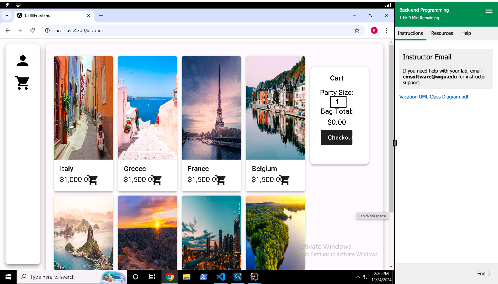

# My Portfolio

Welcome to my portfolio! This is a collection of my projects, coding achievements, and more. Here you’ll find a variety of work that showcases my skills as a data analyst and software developer.

## About Me

I’m Rayyan Kerkmaz, an aspiring developer and data analyst. I’ve spent the last few months honing my skills in coding, learning new technologies, and working on real-world projects. I believe in clarity, continuous learning, and working ethically to solve problems in innovative ways.

You can learn more about me by visiting the **[About Me](about-me.html)** page.

## Projects

Here are some of the key projects I’ve worked on:

### Project 1: Spring Boot Travel App
A backend application built with Spring Boot, helping manage customer reservations and vacation packages.

[GitHub Repository Link]([https://github.com/yourgithublink](https://gitlab.com/wgu-gitlab-environment/student-repos/Rkerkmaz/d288-back-end-programming.git))

## Contact

Feel free to reach out to me at [Rkerkmaz13@gmail.com](mailto:rkerkmaz13@gmail.com).
